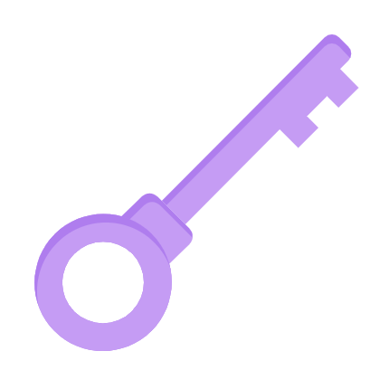

# MyKeychain   

MyKeychain is a secure and easy-to-use password manager that helps you store, manage, and retrieve your passwords effortlessly. Designed with simplicity and privacy in mind, MyKeychain keeps all your login credentials organized and accessible, right when you need them. Whether it's for websites, apps, or personal accounts, MyKeychain ensures your sensitive information stays safe — all in one place.

MyKeychain is a modern and user-friendly password manager designed to help you securely store and manage your credentials. It offers a smooth and responsive user experience powered by React and Tailwind CSS, with additional APIs integrated to enhance interactivity and usability.

The project is built in two versions:

Version 1: A fully client-side solution that stores passwords locally using the browser’s localStorage. Ideal for personal use without server dependency.

Version 2: A full-stack version using Express.js and MongoDB for securely storing passwords on a backend server. This version offers better scalability and persistence across devices.

Whether you're managing personal accounts or multiple logins, MyKeychain keeps your information organized, secure, and readily accessible — all while maintaining a sleek and responsive design.